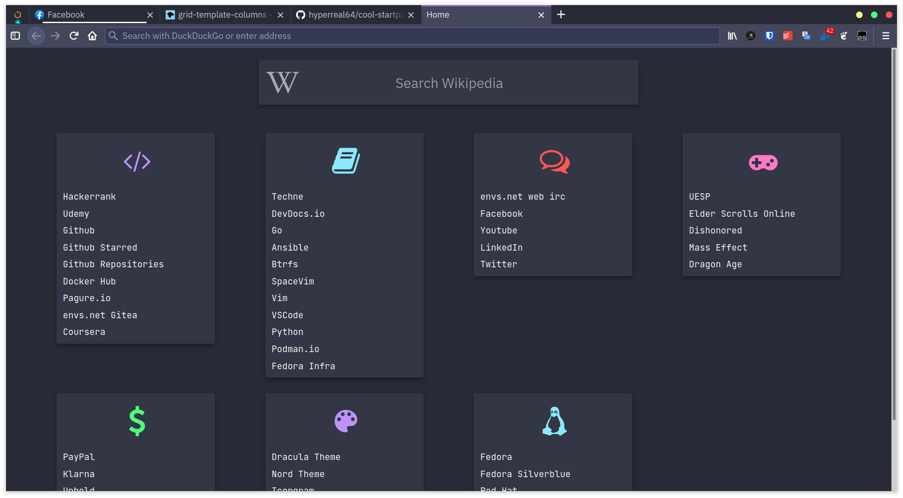

# cool-startpage

I now use a version of this that I publish online here: https://gitlab.com/hyperreal64/hyperreal64.gitlab.io

The code for this was taken from the firefox subdirectory of [dbuxy218/Prismatic-Night](https://github.com/dbuxy218/Prismatic-Night). I made the following changes to reflect my personal preferences:
* `load.js` and `search.js` to make Wikipedia and ArchWiki searchable from the search engine input box. 
* `style.css` to use a grid display with Zeno Rocha's [Dracula theme](https://draculatheme.com) (I'm obsessed with the Dracula theme)
* Arch Linux and Wikipedia icons from [Icongram](https://icongr.am/) for the search engine box
* `index.html` to customize the bookmarks and categories

This is useful for me because:
* It solves my annoyance with bookmark syncing.
* It's aesthetically pleasing.
* Not needing a bookmark toolbar saves precious pixel space on the screen.

I know next to nothing about JavaScript, HTML, and CSS, so I mostly just played this by ear (or rather, eye). One of these days I will figure out how to do this for Chromium-based browsers, but not today.



## Setting the startpage as the Home page
Clone this repo and copy the startpage dir to the firefox profile:
```
git clone https://github.com/hyperreal64/cool-startpage.git
cd cool-startpage
cp -r firefox/startpage ~/.mozilla/firefox/PROFILE_NAME
```

Open `~/.mozilla/firefox/PROFILE_NAME/startpage/index.html` in Firefox. Copy the URI from the address bar and set it as the custom URL for the Home page in Firefox preferences.

## Setting the startpage as the New Tab page
Open `firefox/newtab/mozilla.cfg` from this repo, and paste the custom home page URI on line 7. It should now look something like this:
```javascript
var newTabURL = "file:///home/jas/.mozilla/firefox/tevhdgxf.default-release/startpage/index.html";
```

Now run the following commands:
```shell
cd firefox/newtab
sudo cp mozilla.cfg /usr/lib64/firefox/
sudo cp local-settings.js /usr/lib64/firefox/defaults/pref/
```

Note: The Firefox library path might be different depending on your Linux distribution. On Fedora, it is `/usr/lib64/firefox`, but on other distros it might be `/usr/lib/firefox`.

Restart Firefox, and you should be good to go.

The colorscheme is [Dracula](https://draculatheme.com/) by [Zeno Rocha](mailto:hi@zenorocha.com) and is distributed under an [MIT License](https://zenorocha.mit-license.org/).
